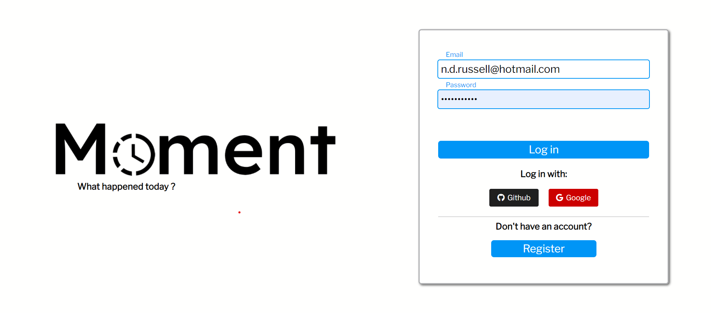
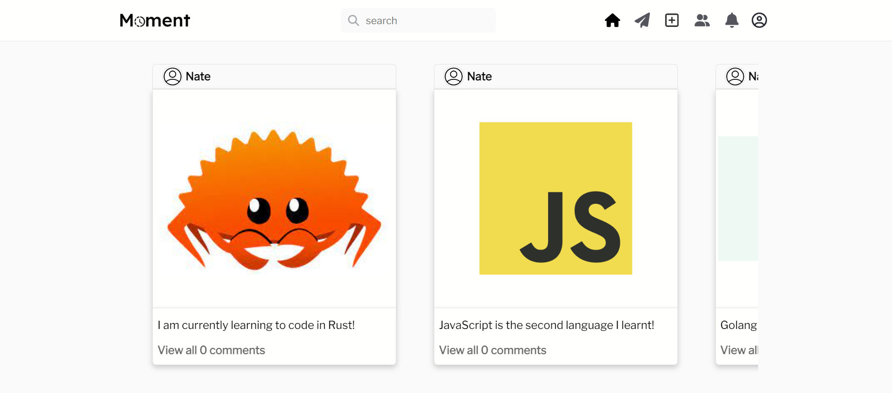

# Moment

A social media website taking inspiration from Instagram and Facebook, built with React, Golang, Docker, SQLite3, and CSS.




## Installation and Setup Instructions

You will need `Docker` installed globally on your machine.

A Dockerfile has been made for both the frontend and backend.

There is also a makefile that has commands to build both docker images.

Before building the docker images you must ensure that docker is installed and running on your machine.

### Step 1

Clone this repository

```bash
git clone git@github.com:NRK-group/Moment.git
```

### Step 2

Navigate to the root directory of the project

```bash
cd Moment
```

### Step 3

Build the application. Run the following command in the root directory of the project to build the docker images.

```bash
make build
```

### Step 4

Open [localhost:8070](http://localhost:8070) in your browser to view the application.

## Step 5

Register an account and start posting!
