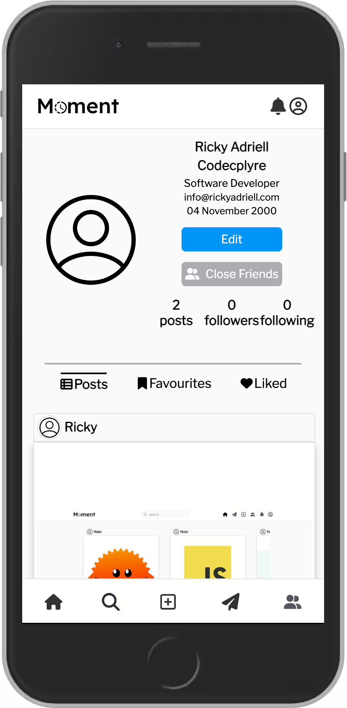

# Moment

## A full-stack social media website

Ricky Adriell, Keivon, Nate,

---

<!--
paginate: true
footer: "Moment"
-->

# What are we talking about today?

- What is Moment?
- Technologies used
- Features of Moment
- Demo
- Q&A

---

# What is Moment?

a social media website that takes design inspiration from Instagram and Facebook.

---

# Technologies used

- React
- HTML
- CSS
- Javascript
- Go
- Sqlite
- Docker

---

# Features of Moment

- ➡️ Register & Login
- Posts
- Comments
- Profile

---

# Register & Login

---

# Features of Moment

- ✅ Register & Login
- ➡️ Posts
- Comments
- Profile

---

# Posts

---

# Features of Moment

- ✅ Register & Login
- ✅ Posts
- ➡️ Comments
- Profile

---

# Comments

---

# Features of Moment

- ✅ Register & Login
- ✅ Posts
- ✅ Comments
- ➡️ Profile

---

# Profile

___

# Demo

- [moment](http://localhost:8070)

---

# Q&A

---

Thank you for listening!
